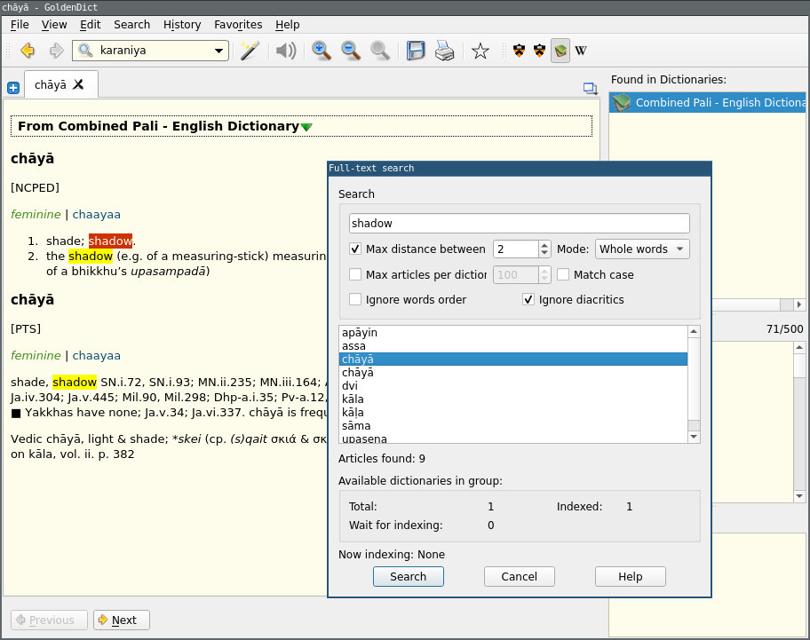
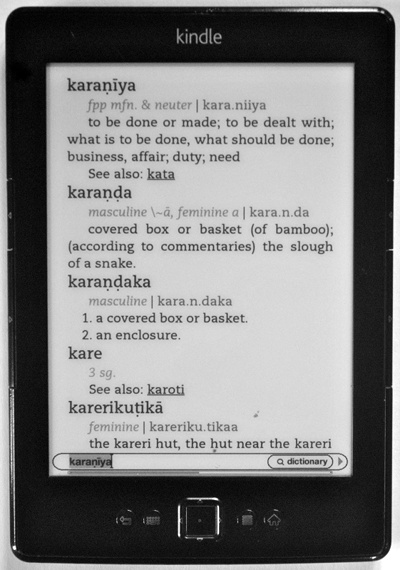

# Simsapa Dictionary Tool

<!-- markdown-toc start - Don't edit this section. Run M-x markdown-toc-refresh-toc -->
**Table of Contents**

- [Simsapa Dictionary Tool](#simsapa-dictionary-tool)
    - [What is this for?](#what-is-this-for)
    - [Desktop setup with GoldenDict](#desktop-setup-with-goldendict)
        - [Install GoldenDict](#install-goldendict)
        - [Download the dictionary](#download-the-dictionary)
        - [Add to GoldenDict](#add-to-goldendict)
    - [Converting to other dictionary formats](#converting-to-other-dictionary-formats)
    - [simsapa_dictionary tool](#simsapadictionary-tool)
    - [Dictionary texts](#dictionary-texts)
        - [Sources](#sources)
    - [Applications](#applications)
        - [GoldenDict (Win, Mac OSX, Linux desktop)](#goldendict-win-mac-osx-linux-desktop)
        - [Kindle Paperwhite](#kindle-paperwhite)
        - [Epub readers](#epub-readers)
        - [Android](#android)
    - [Online Pali dictionaries](#online-pali-dictionaries)
    - [Example dictionary file](#example-dictionary-file)
    - [CLI Options](#cli-options)
    - [Feedback, corrections, bug reports](#feedback-corrections-bug-reports)

<!-- markdown-toc end -->

## What is this for?

This tool generates EPUB, MOBI, Stardict (.zip) and Babylon (.gls) dictionary files.

I hope it is useful for:

- looking Pali words more easily on different devices
- with fulltext search (looking for English words in Pali)
- in an offline context

The main result are the downloadable files:

**Download Pali - English dictionaries**:  See the [Releases](https://github.com/simsapa/simsapa-dictionary/releases) page.

You are going to need a dictionary application for your desktop or mobile
device, then download and use a suitable format to open it.

For example the StarDict format is widely supported, search for `dictionary app
stardict format for Windows / Mac / Android` or similar to find an app which
works for you.

Download one of the formats and open it with the dictionary app.

## Desktop setup with GoldenDict

Specific steps to use this with GoldenDict.

### Install GoldenDict

Note that the [goldendict.org](http://www.goldendict.org/) website only has an old version (1.0.1) for Windows.

Download the more recent v1.5 version:

- [Early Access Builds for Windows](https://github.com/goldendict/goldendict/wiki/Early-Access-Builds-for-Windows)
- [Early Access Builds for Mac OS X](https://github.com/goldendict/goldendict/wiki/Early-Access-Builds-for-Mac-OS-X)
- [Early Access Builds for Linux Portable](https://github.com/goldendict/goldendict/wiki/Early-Access-Builds-for-Linux-Portable)

On Linux distributions, you can also install the `goldendict` package from your package manager.

### Download the dictionary

Download one of the StarDict `.zip` files from the [Releases](https://github.com/simsapa/simsapa-dictionary/releases) page.

Extract the `.zip` to a folder, if will contain four files, such as:

```
combined-dictionary-stardict/
  combined-dictionary.dict.dz
  combined-dictionary.idx
  combined-dictionary.ifo
  combined-dictionary.syn
```

### Add to GoldenDict

- Open GoldenDict.
- Select the `Edit > Dictionaries` menu. It usually opens with the `Sources > Files` tab open.
- Click the `Add...` button, and select the folder where you extracted the `.zip`.
- Click `OK`. The menu will close.
- Use the top input field to search for words.
- Use the `Search > Full-text Search` menu to search in the word definition texts (such as looking for English to Pali).

Add more dictionaries in other languages if you wish. Search for example `portuguese stardict dictionary`.

## Converting to other dictionary formats

The [pyglossary](https://github.com/ilius/pyglossary) tool can convert to a wide range of dictionary formats.

You can use the StarDict files as input format.

## simsapa_dictionary tool

The binary executables (`simsapa_dictionary.exe`, `_linux`, `_osx`) are command line applications.

If you simply double click to run it, it will do nothing. If you run it in a terminal, it will display some usage notes.

It is a conversion utility, which can be used in small shell scripts to create or update dictionary files.

## Dictionary texts

The dictionary source texts are in the [simsapa-dictionary-data](https://github.com/simsapa/simsapa-dictionary-data) repo.

You can download the source text, edit and generate updated EPUB and MOBI files using this tool.

To generate MOBI files, also download [Kindlegen](https://www.amazon.com/gp/feature.html?docId=1000765211) from Amazon (free download).

### Sources

- JSON format dictionaries published at [suttacentral/sc-data](https://github.com/suttacentral/sc-data)
- [Nyanatiloka: Buddhist Dictionary](https://what-buddha-said.net/library/Buddhist.Dictionary/index_dict.n2.htm) published by [what-buddha-said.net](https://what-buddha-said.net/)

## Applications

### GoldenDict (Win, Mac OSX, Linux desktop)



Use the `*-stardict.zip` files, extract them and add the folder to the dictionary list in GoldenDict.

Version 1.5 includes `Search menu > Full text search`, useful for English to Pali searches.

For Windows and OSX, download v1.5 from the [Early Access Builds](https://sourceforge.net/projects/goldendict/files/early%20access%20builds/).

Read mode on the [wiki pages](https://github.com/goldendict/goldendict/wiki).

On Linux, install `goldendict` from your package manager.

### Kindle Paperwhite



Use one of the `*.mobi` files and copy them to your Kindle. It will appear in the *Dictionaries* category.

### Epub readers

The `*.epub` files can be used with ebook readers which read the Epub format.

- iBooks on iOS
- [Calibre](https://calibre-ebook.com/) on desktop

### Android

Search for applications which can open or import `StarDict` format dictionaries.

You might have to copy-paste the link of a `*-stardict.zip` file from the
Releases page, or download it and extract it to a folder where the dictionary
application can find it.

Such apps include:

- [Dict Box - Universal Offline Dictionary](https://play.google.com/store/apps/details?id=com.grandsons.dictsharp)
- [GoldenDict (free)](https://play.google.com/store/apps/details?id=mobi.goldendict.android.free)

## Online Pali dictionaries

- SuttaCentral dictionary lookup: https://suttacentral.net/define/kusala
- [Critical Pali Dictionary](https://cpd.uni-koeln.de/search.php)
- http://dictionary.sutta.org/
- http://www.buddha-vacana.org/toolbox/dico.html
- [English-Pali Dictionary (budsas.org)](https://www.budsas.org/ebud/dict-ep/index.htm)

## Example dictionary file

See an example dictionary content below. It starts with metadata describing the
dictionary, followed by the word entries. Each word entry starts with a
[TOML](https://github.com/toml-lang/toml) formatted block, followed by the
definition text in Markdown syntax.

Use a text editor such as Notepad++ and copy the example to a file, for example `ncped-example.md`.

The file extension must be `.md`.

Arrange the files in a folder:

```
dictionary/
  kindlegen.exe
  ncped-example.md
  simsapa_dictionary.exe
```

On Windows, drag-and-drop `ncped-example.md` on the `simsapa_dictionary.exe`.

On Linux and Mac, open a terminal in the folder and run `./simsapa_dictionary ./ncped-example.md`.

The default action is to generate a MOBI if `kindlegen.exe` is also present in the folder, otherwise to generate an EPUB.

More options are available, see them with `simsapa_dictionary.exe --help`. An overview is included below.

```
ndped-example.md
```

    --- DICTIONARY METADATA ---
    
    ``` toml
    title = "New Concise Pali - English Dictionary (NCPED)"
    description = "Pali - English"
    creator = "Simsapa Dhamma Reader"
    source = "https://simsapa.github.io"
    cover_path = "default_cover.jpg"
    book_id = "NcpedDictionarySimsapa"
    created_date_human = ""
    created_date_opf = ""
    ```
    
    --- DICTIONARY WORD ENTRIES ---
    
    ``` toml
    dict_label = "NCPED"
    word = "ababa"
    summary = "the name of a hell, or place in Avīci, where one s"
    grammar = ""
    inflections = []
    ```
    
    ababa
    
    masculine the name of a hell, or place in Avīci, where one suffers for an *ababa* of years.
    
    ``` toml
    dict_label = "NCPED"
    word = "abbhantara"
    summary = "interior, internal; being within, included in, amo"
    grammar = ""
    inflections = []
    ```
    
    abbhantara
    
    mfn. & neuter
    
    1. (mfn.) interior, internal; being within, included in, among; belonging to one ‘s house, personal, intimate.
    2. (n.)
       1. intermediate space, interval; the inside, interior.
       2. a measure of length (= 28 hatthas).
    
    ``` toml
    dict_label = "NCPED"
    word = "ajjhokāse"
    summary = "in the open air, in the open."
    grammar = ""
    inflections = []
    ```
    
    ajjhokāse
    
    ind. in the open air, in the open.

## CLI Options

Use the `help` command to discover the command line options, or see [src/cli.yml](src/cli.yml).

```
./simsapa_dictionary help
```

## Feedback, corrections, bug reports

Both the tool and the dictionary content has some rough edges.

The dictionary entries can be edited using the files at
[simsapa-dictionary-data](https://github.com/simsapa/simsapa-dictionary-data),
and the dictionary formats re-generated with this tool.

Dictionary corrections or bug reports about the tool are welcome. Open an Issue
here or see my email in the [Cargo.toml](Cargo.toml).

